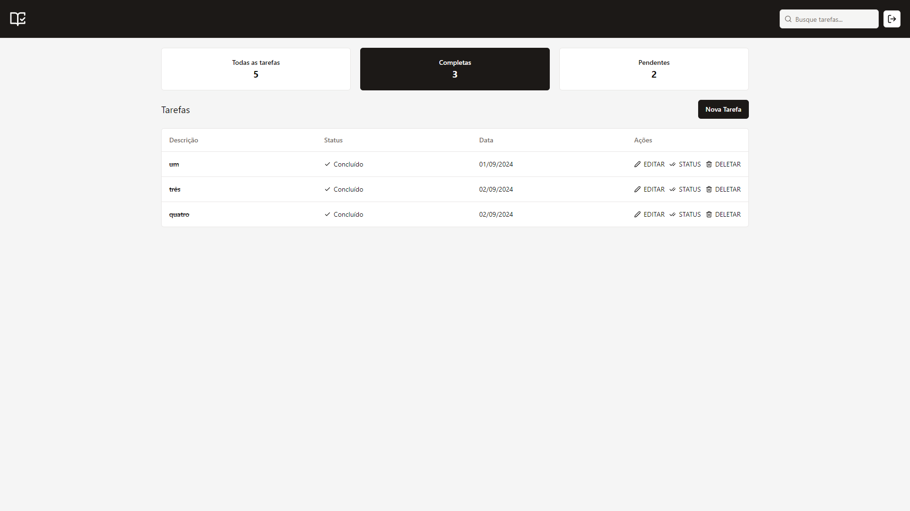

# Jack Experts - Desafio Full Stack

Aplicação **full stack** de gerenciamento de tarefas que permite criar, editar, excluir e visualizar tarefas.




## 📖 Sobre o BACK-END

No **back-end**, toda a aplicação foi desenvolvido seguindo os princípios do **SOLID**. Além de um CRUD de tarefas, foi criado um middleware de autenticação que controla com **JSON Web Token** se o usuário que está gerenciando a tarefa está autenticado. Também foi implementado um middleware para controlar as instâncias de erros de acordo com o tipo de erro. Os serviços da aplicação foi testado utilizando o **Vitest**. Todas as rotas da aplicação foram documentadas com o **Swagger**.

### ⚙️ Como rodar o back-end
```bash
# 1 - Acesse a pasta do back-end

# 2 - Crie uma variável de ambiente na raiz o projeto chamada de `.env`, e preencha ela usando como referência o arquivo `.env.example`

# 3 - Instale as dependência do projeto
$ npm install

# 4 - Faça a build do projeto
$ npm run build

# 5 - Rode as migrations
$ npm run migration:run

# 6 - Inicie a aplicação
$ npm start
```

### 🛠️ Tecnologias utilizadas
- Node.JS
- TypeScript
- Express.JS
- TypeORM
- Vitest
- Zod
- JSON Web Token
- Swagger

### Funcionalidades
- CRUD de tarefas
- Fluxo de autenticação
- Middleware para controlar as instâncias de erro
- Testes unitários
- Validação de dados
- Documentação das rotas


## 📖 Sobre o FRONT-END

No **front-end**, temos formulários para o usuário poder criar a acessar suas contas, formulário esses que foram validados com o **Zod** e o **React Hook Form**. Também foi desenvolvido com a **Context API** um fluxo para controlar a autenticação e rotas privadas do sistema. Além de um CRUD de tarefas também foi implementado a funcionalidade de buscar tarefas pela sua descrição e também um filtro que permite obter as tarefas pelo seu status.

### ⚙️ Como rodar o front-end
```bash
# 1 - Acesse a pasta do front-end

# 2 - Crie uma variável de ambiente na raiz o projeto chamada de `.env`, e preencha ela usando como referência o arquivo `.env.example`

# 3 - Instale as dependência do projeto
$ npm install

# 4 - Faça a build do projeto
$ npm run build

# 5 - Inicie a aplicação
$ npm run preview
```

### 🛠️ Tecnologias utilizadas
- React.JS
- TypeScript
- TailwindCSS
- Shadcn/ui
- React Hook Forms
- Zod

### Funcionalidades
- CRUD de tarefas
- Filtrar tarefas por status
- Buscar tarefa pela sua descricão
- Fluxo de autenticação
- Controle de rotas privadas

---

<div style="text-align: center; margin-top: 20px;">
  <a href="https://desafio-jackexperts.vercel.app" target="_blank">VISITAR PROJETO</a>
</div>
